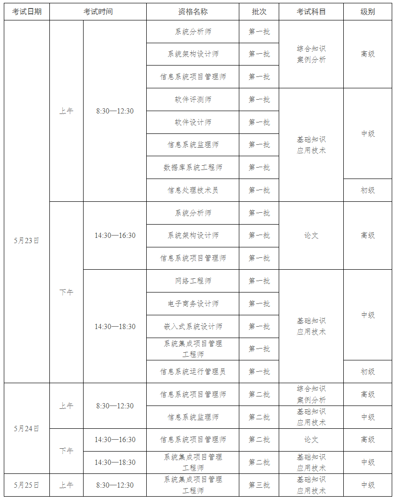
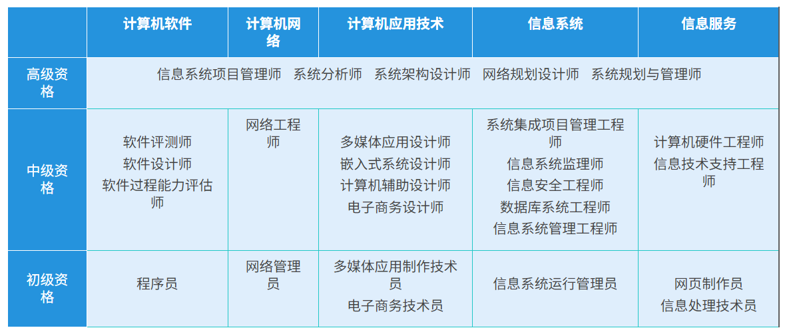

# 计算机技术与软件专业技术资格考试

* [计算机技术与软件专业技术资格考试](https://www.ruankao.org.cn/), 简称软考
* 每年组织两次, 在第二季度和第四季度进行
* 上半年报名时间一般在3月, 考试在5月; 下半年报名时间一般在8月, 考试在10月

## 考试方式

考试为计算机化考试(机考), 采取科目连考,分批次实施的方式, 第一个科目节余的时长可为第二个科目使用

**高级资格**
* 共考3门
* 综合知识和案例分析2个科目连考, 作答总时长240分钟
* 综合知识科目最长作答时长150分钟, 最短作答时长120分钟
* 综合知识科目交卷成功后, 选择不参加案例分析科目考试的可以离开考场
* 选择继续作答案例分析科目的, 考试结束前60分钟可以交卷离场
* 论文科目考试时长120分钟, 不得提前交卷离场

**初,中级资格**
* 共考2门
* 基础知识和应用技术2个科目连考, 作答总时长240分钟
* 基础知识科目考试最长作答时长120分钟, 最短作答时长90分钟
* 选择不参加应用技术科目考试的考生开考2小时后可以交卷离场
* 选择继续作答应用技术科目的, 考试结束前60分钟可以交卷离场

## 考试批次安排示例

## 其他事项

* 考前会提供网上模拟练习平台, 供考生熟悉机试环境
* 可用的输入法包括
  * 微软拼音
  * 极点五笔
  * 搜狗拼音
  * 搜狗五笔
* 考试结束后45天内, 可查询成绩

## 考试内容

### 初级资格

* [程序员](res/初级_程序员.png)
* [网络管理员](res/初级_网格管理员.png)
* [电子商务技术员](res/初级_电子商务技术员.png)
* [信息系统运行管理员](res/初级_信息系统运行管理员.png)
* [初级_信息处理技术员](res/初级_信息处理技术员.png)

## 历史考试时间

* 2026
  * 5月23日至26日
  * 10月24日至27日

## 科目题型

### 基础知识

* 题型: 75道单选, 每题1分, 满分75分, 45分以上合格

### 应用技术

* 题型: 5~6道主观大题, 满分75分, 45分以上合格
* 形式
  * 流程图/算法填空
  * C语言编程
  * C++编程/Java编程
